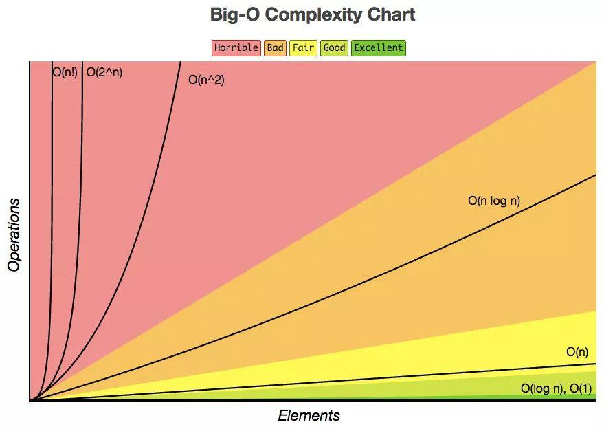

# 如何分析算法的效率？

学习数据结构与算法，是为了能够选择最合适的数据结构与算法来实现具体的需求。“合适”的含义，我们可以简单地认为就是尽可能做到执行速度快、占用空间小。

那我们该怎么分析算法的效率呢？

## 事后统计法

摆在眼前最容易想到的方法就是，直接使用写好的代码去执行一遍就能知道这个算法的效率了。

这种方法被称为**事后统计法**，就是在完成之后再做统计。

看起来，事后统计法是非常准确的一种统计方法，但是会有以下的局限性：

- **测试结果非常依赖测试环境**：硬件的不同会对测试结果有比较大的影响。比如不同处理器的执行时间会不一样
- **测试结果受数据的影响很大**：对同一个排序算法，待排序数据的有序度会影响算法的执行时间，待排序数据的规模也会影响算法的执行效率。比如插入排序对小规模数据排序比快速排序更块

## 复杂度分析法

相比事后统计法，复杂度分析法更能表示一个算法在各个维度的综合性能。

我们将复杂度分为**时间复杂度**和**空间复杂度**。

时间复杂度表示的是执行时间与数据规模之间的增长关系；空间复杂度表示的是存储空间与数据规模之间的增长关系。

### 复杂度表示法

常用的复杂度表示法就是大 O 复杂度表示法，时间复杂度和空间复杂度都能运用这个概念，在概念上可以进行类比。

在实际使用中，考虑时间复杂度的场景会更多一些，这里只对时间复杂度做解析。

### 大 O 时间复杂度表示法

时间复杂度的大 O 复杂度表示法就是大 O 时间复杂度表示法。这里拿下面的代码解析一下时间复杂度：

```c
int cal(int n) {
    int sum = 0;
    int i = 1;
    for (; i <= n; ++i) {
        sum = sum + i;
    }
    return sum;
}
```

执行这个函数的时候，第 2 行和第 3 行只会运行一次，第 4、5、6 行是一个 for 循环，将会运行 n 次。因此，我们将整个函数运行的次数简单地认为是 n + 2 次。

假如，将一行代码的执行时间作为单位时间，以此推算得出，这个函数的执行时间 $T(n)$ 与整个函数的执行次数 n 成正比：

$$
T(n) = O(f(n))
$$

这里，n 表示数据规模的大小；$f(n)$ 表示每行代码执行的次数总和，$T(n)$ 表示代码执行的时间，公式中的 O 表示代码的执行时间 $T(n)$ 与 $f(n)$ 表达式成正比。

看得出来，大 O 时间复杂度实际上并不具体表示代码的真实执行时间，而是表示代码执行时间随数据规模增长的变化趋势。

因此，大 O 时间复杂度又称作渐进时间复杂度（asymptotic time complexity），简称时间复杂度。

再从定义上理解，大 O 复杂度表示法是一种算法「**复杂度**」的「**相对**」「**表示方式**」：

- **复杂度**：相对其他东西的度量结果
- **相对**：只能比较相同的事物，不能将查找算法与排序算法进行比较
- **表示方法**：这仅仅是一个表示方法，与具体的数据无关

## 时间复杂度分析

分析一个算法的时间复杂度有一定的方法，依据这些方法能够求出大部分算法的时间复杂度。

### 变量法则

**代码中的变量决定时间复杂度。**

大 O 复杂度表示法是一种函数的表示方式，函数中存在至少一个变量，这其实就说明了大 O 复杂度表示法展示了代码执行时间随数据规模增长的变化趋势。

所以，在分析时间复杂度的时候，需要记住代码中的变量决定时间复杂度，观察代码中具体哪一个数据变量在实际运行中最能体现运行时间的趋势。

### 加法法则

**总复杂度等于量级最大的那段代码的复杂度。**

大 O 复杂度表示法只是表示一种变化趋势。一般认为，与公式中的高阶 n 值相比，常量、系数、低阶量级与算法的增长趋势关系不大。

为了降低复杂性以及提高对比性，通常会忽略掉公式中的常量、系数、低阶，只记录其中最大阶的量级。

因此，在分析一个算法、一段代码的时间复杂度时，一般只需要关注循环执行次数最多的那一段代码。

通常，核心代码执行次数的 n 的量级，就是整段要分析代码的时间复杂度。

### 乘法法则

**嵌套代码的复杂度等于嵌套内外代码复杂度的乘积。**

在实际开发中，嵌套循环的代码比较常见，这里涉及到嵌套循环的时间复杂度分析。

假设函数体存在一个执行 n 次的循环，每次循环中又存在一个执行 m 次的内循环，可以简单地得出整体循环 $n \times m$ 次。

大部分算法复杂度分析中，会遇到如 $n^2$、$n^3$ 这样的时间复杂度，算是乘法法则的应用。

### 最高阶法则

**时间复杂度由最高阶的项来决定。**

在 n 趋向于无穷大的时候，最高阶的项将发挥主导作用，其他项的影响都可以忽略。

这个其实算是加法法则的另一种场景，对于存在多种嵌套计算的代码，有可能会涉及到 n 的多个阶级，这里总会认为最高阶的项起主导作用。

## 常见的时间复杂度

常见的时间复杂度有很多，如 $O(1)$、$O(\log n)$、$O(n)$、$O(n \log n)$、$O(n^2)$、$O(2^n)$、$O(n!)$ 等。

这里将时间复杂度分为两类：一类是以 n 作为底数的多项式量级，另一类是不以 n 作为底数的非多项式量级。

在上面的常见时间复杂度中，只有 $O(2^n)$、$O(n!)$ 是非多项式量级，其他都是多项式量级。

其实看得出来，当数据规模 n 越来越大的时候，非多项式量级算法的执行时间会急剧增加，求解问题的执行时间会无限增长。

因此，**非多项式时间复杂度的算法是非常低效的算法**，实际编码中需要尽量避免这种情况出现。

### 常量级

常量级时间复杂度指的是执行时间不随 n 的增大而增长的时间复杂度。常量级时间复杂度使用 $O(1)$ 表示。

一般情况下，只要算法中不存在循环语句、递归语句，即使有成千上万行的代码，其时间复杂度都是 $O(1)$。

### 对数级

对数级时间复杂度非常常见，同时也是最难分析的一种时间复杂度。

实际上，不管是以 2 为底、以 3 为底，还是以 10 为底，都可以把所有对数阶的时间复杂度都记为 $O(\log n)$。

> $O(\log_3n) = O(\log_32) \times O(\log_2n)$ => $O(\log_3n) = O(C \times \log_2n)$，其中 $C = log_32$ 是一个常量可忽略不计。

如果一段代码的时间复杂度是 $O(\log n)$，然后代码循环执行 n 遍，这段代码就是 $O(n \log n)$ 的时间复杂度。比如归并排序、快速排序的平均时间复杂度就是 $O(n \log n)$。

### 多变量级

多变量级时间复杂度受多个变量影响，表示一个时间复杂度由多个数据的规模来决定。

这种情况不能随意使用加法法则省略掉其中一个，而是相关变量都使用到，如 $O(m \times n)$、$O(m + n)$ 就是多变量级的复杂度。

## 时间复杂度维度

对于同样的算法，有些数据分布计算得到的时间复杂度比较差，有些数据分布计算得到的事件复杂度比较好。

### 最好情况时间复杂度

最好情况时间复杂度就是，在最理想的情况下，执行这段代码的时间复杂度。

### 最坏情况时间复杂度

最坏情况时间复杂度就是，在最糟糕的情况下，执行这段代码的时间复杂度。

在实际情况下，最好情况时间复杂度通常在很小的概率下才能达到，具有一定的误导性。而最坏情况时间复杂度给出了一个效率安全值，因此显得更加实用。

### 平均时间复杂度

平均时间复杂度会将所有可能情况下的执行次数和其发生的频率聚合起来计算加权平均值。

这里涉及到概率论的知识，因此平均时间复杂度又被称为加权平均时间复杂度、期望时间复杂度。

### 均摊时间复杂度

均摊时间复杂度是一种适用场景更少的表示方式。

对于某些特殊的场景（比如一种场景是大部分情况下时间复杂度都很低，只有个别情况下时间复杂度比较高，而且这些操作之间存在前后连贯的时序关系），就可以引入摊还分析法计算得出均摊时间复杂度。

比如说，对顺序队列执行入队的操作时，大部分时候只需要直接在对应位置添加元素即可，一旦入队的位置达到顺序表的末尾，则需要执行搬移数据以保证成功入队。

对于这个场景，入队这个操作需要放在一起分析，搬移数据的情况相对于普通情况是少之又少的，尝试将这个操作的耗时平摊的普通情况上，最终得出均摊时间复杂度。

通常，在能够应用均摊时间复杂度分析的场合，均摊时间复杂度就等于最好情况时间复杂度。

## 复杂度变化趋势

这里用图展示一下常见时间复杂度随数据规模变化的情况。

从左到右排列依次是：$O(n!)$ > $O(2^n)$ > $O(n^2)$ > $O(n \log n)$ > $O(n)$ > $O(\log n)$ > $O(1)$。



超过 $O(n \log n)$ 的复杂度就会随着 n 的变化而急剧变化。在实际开发中，应当尽量避免出现超过此时间复杂度的情况。
